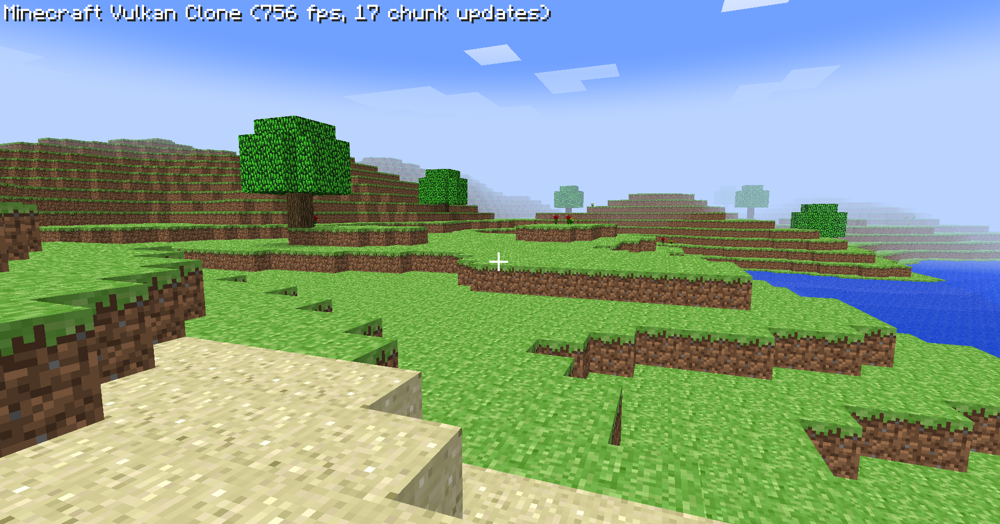

# Vulkan Minecraft Clone

A Minecraft clone built with Vulkan, compatible with both Windows and Linux.



## Installation

### Option 1: Prebuilt Release (Recommended)

1. Go to the [Releases page](https://github.com/raphvrl/vk-minecraft-clone/releases)
2. Find the latest version (e.g., v0.1.0-alpha)
3. Download the appropriate file for your system:
   - `vulkan-minecraft-windows-vX.X.X.zip` for Windows
   - `vulkan-minecraft-linux-vX.X.X.zip` for Linux
4. Extract the archive and run the game:
   - On Windows: run `vulkan-minecraft.exe`
   - On Linux: run `./vulkan-minecraft`

### Option 2: Building from Source

#### Prerequisites

**Windows:**
- Windows 10/11
- [Vulkan SDK](https://vulkan.lunarg.com/sdk/home)
- MSYS2 with MinGW-w64

**Linux:**
- Recent distribution (Ubuntu 22.04+, Fedora 36+, etc.)
- Vulkan SDK: `sudo apt install libvulkan-dev vulkan-tools` (Ubuntu/Debian)
- Development dependencies:
  ```bash
  sudo apt install build-essential cmake glslang-tools libgl1-mesa-dev xorg-dev libwayland-dev libxkbcommon-dev
  ```

#### Build Steps

1. Clone the repository with its submodules:
   ```bash
   git clone --recursive https://github.com/raphvrl/vk-minecraft-clone.git
   cd vulkan-minecraft
   ```

2. Build the project:
   ```bash
   make
   ```

3. Run the game:
   - **Windows**: `./vulkan-minecraft.exe`
   - **Linux**: `./vulkan-minecraft`

## System Requirements

- Graphics card with Vulkan 1.3+ support
- Windows 10/11 or Linux with Vulkan support

## Controls

- WASD: Movement
- Space: Jump
- Mouse: Look around
- Left click: Destroy block
- Right click: Place block
- Escape: Pause menu

## Features

- Procedural terrain generation
- lighting system
- Sky and cloud rendering
- Block system with different textures
- First-person controls

## Disclaimer

This project is a fan-made clone created for educational purposes only. It is not affiliated with, endorsed by, or connected to Mojang or Microsoft in any way.

All Minecraft textures, sounds, and other assets used in this project belong to Mojang AB. This project does not distribute any copyrighted assets.

"Minecraft" is a trademark of Mojang Synergies AB.
